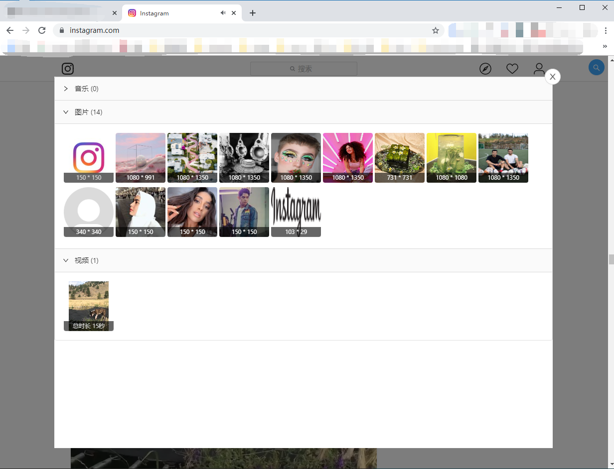

# media-sniffer

### description
搜寻当前页面图片、音乐、视频资源的油猴脚本    

### 项目特点
- 基于[template-react-tampermonkey](https://github.com/xiaomingTang/template-react-tampermonkey)开发, 用户可自由配置

### warning
- 注意, 图片/视频下载功能是调用的GM_download, 由于浏览器响应问题, 可能有时候点击下载却没反应, 是正常的, 不愿意等的可以点击标题在新页面打开并下载

- 由于不同站点的功能实现千奇百怪, 该脚本只适用部分网站, 可能在一些网站, 你明明就看着一张图片在脸上, 可脚本就是看不见, 这是正常的, 本人不保证脚本适用所有网站
